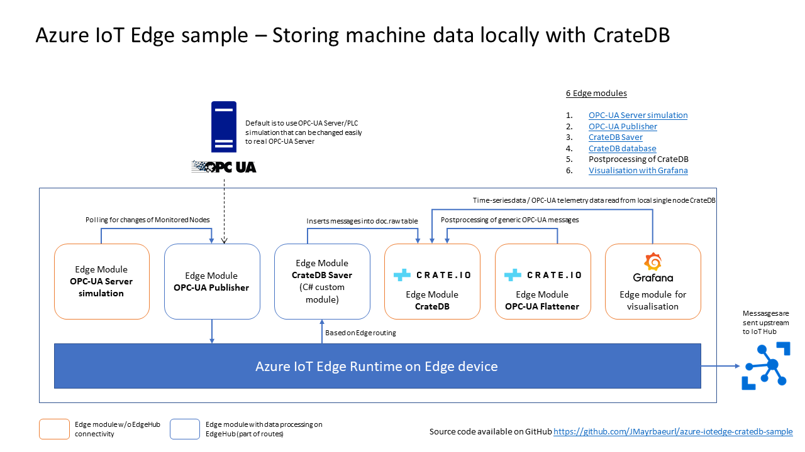

# Azure IoT Edge CrateDB sample

This is an [Azure IoT Edge](https://azure.microsoft.com/en-us/services/iot-edge/) sample showing how to store machine data from OPC-UA servers locally in a single node [CrateDB](https://crate.io/) database. All necessary components will be deployed by Azure IoT Edge.

# Configuration

To be able to run this sample on your edge device, you'll have Azure IoT Edge installed on the device, including a container runtime like Docker. The sample was developed on a Windows 10 IoT machine with Docker Desktop and Linux container. 

Since this sample was developed with Visual Studio Code, the easiest way to run the sample is by using Visual Studio Code with the according Azure IoT Edge Plugin, as used for [custom module development of Azure IoT Edge](https://docs.microsoft.com/en-us/azure/iot-edge/tutorial-csharp-module).

## Configuring the local database

Before starting to deploy the sample to the edge device, the local CrateDB used in the sample has to be created first. An existing CrateDB in the local network could be used, too, but this sample uses CrateDB running in a container on the same device as the Azure IoT Edge runtime. 

1. Create a folder on the disk for the CrateDB database files, e.g. `C:\Dev\docker\mounts\crate\data`
2. Run CrateDB locally from the command line by using `docker run -p "4200:4200" -d --rm --name cratedb -v C:\Dev\docker\mounts\crate\data:/data crate` and replace it with the folder you have created before in step 1
3. Open a web browser with `http://localhost:4200` and go to the CrateDB console
4. Create the tables and the user by executing all SQL Statements in the file `./scripts/createTable.sql`
5. Stop the container with `docker container stop cratedb`
6. Edit the files `deployment.template.json` and `deployment.debug.template.json` by changing the database folder location from `C:/Dev/docker/mounts/crate/data` to your database files location (as done in step 1)

## Configuring the OPC-UA Publisher edge module

1. Per default this sample uses all nodes from the [OPC-UA Server simulation](https://github.com/Azure-Samples/iot-edge-opc-plc). If you want to change the setup, just edit the `publishednodes.json` file in the folder `appdata`
2. Edit the files `deployment.template.json` and `deployment.debug.template.json` by changing the publisher's data folder from `C:/Dev/iotedge/crate/localstorageCrateDBEdgeSolution` to the directory you've downloaded the source repository on your local disk.

# Running the sample

Easiest way to run the sample is by using Visual Studio Code.